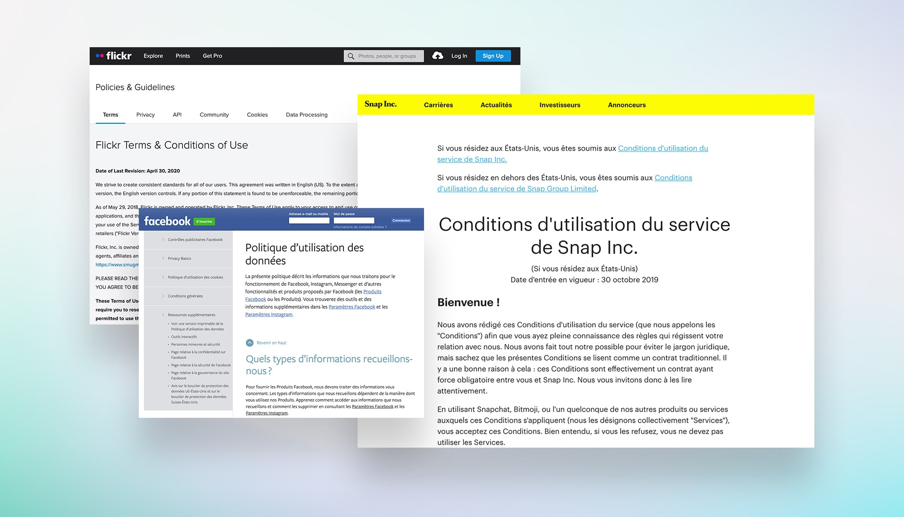

# CGUs



Services have terms that can change over time. CGUs enables users rights advocates, regulatory bodies and any interested citizen to **follow the changes to these terms**.
{: .text-lg }

### Follow the changes to the Terms of Service

Services are declared within CGUs with a declaration file listing all the documents that, together, constitute **the terms under which this service can be used**. These documents all have a type, such as “terms and conditions”, “privacy policy”, “developer agreement”.

The practices described regarding information manipulation can lead to a **better understanding of the vulnerabilities** of these actors and the transcription of legislative constraints, recommendations from public authorities or voluntary measures implemented enables us to **appreciate their loyalty**.

### Case studies

- Google has changed its Review Guidelines to prohibit apps that hat mislead users by impersonating someone else or another app or falsely imply a relationship to another company / developer. These measures thus close certain vulnerabilities exploited for information manipulation. [See the change](https://github.com/ambanum/CGUs-versions/commit/98f6c).

- TikTok refers to Comminuty Guidelines to offer its users the opportunity to report content that would be considered inappropriate. [See the change](https://github.com/ambanum/CGUs-versions/commit/0d2f0386).

- Google AdSense has changed its Acceptable Use Policy to add a reference to Coordinated Deceptive Practices to prohibit (i) practices that seek to coordinate with other sites or accounts and concealing or misrepresenting identity or other material details, when content relates to politics, social issues or matters of public concern and (ii) directe content about politics, social issues, or matters of public concern to users in a country other than one's own, if you misrepresent or conceal one's country of origin or other material details. [See the change](https://github.com/ambanum/CGUs-versions/commit/c62b7).

[Discover more case studies](https://github.com/ambanum/CGUs/wiki/%C3%89tudes-de-cas){: .button .button-secondary}
{: .text-center }

## How it works

_Words in bold are [business domain names](https://en.wikipedia.org/wiki/Domain-driven_design)._

**Services** are **declared** within _CGUs_ with a **declaration file** listing all the **documents** that, together, constitute the **terms** under which this **service** can be used. These **documents** all have a **type**, such as “terms and conditions”, “privacy policy”, “developer agreement”…

In order to track their **changes**, **documents** are periodically obtained by fetching a web location and selecting content within the web page to remove the noise (ads, navigation menu, login fields…).

Anyone can run their own private instance and track changes on their own. However, we also publish each version on a [**public** instance](https://github.com/ambanum/CGUs-versions) that makes it easy to explore the entire history and enables notifying over email whenever a new version is recorded.
Users can [**subscribe** to **notifications**](#be-notified).

_For now, when multiple versions coexist, **terms** are only **tracked** in their English version and for the European jurisdiction._

### Exploring the versions history

From the **repository homepage** [CGUs-versions](https://github.com/ambanum/CGUs-versions), open the folder of the service of your choice. You will see the set of documents tracked for that service, now click on the document of your choice. The latest version (updated hourly) will be displayed.

_For more details, see our [wiki](https://github.com/ambanum/CGUs#exploring-the-versions-history)_.

### Be notified

You can [subscribe](https://59692a77.sibforms.com/serve/MUIEAKuTv3y67e27PkjAiw7UkHCn0qVrcD188cQb-ofHVBGpvdUWQ6EraZ5AIb6vJqz3L8LDvYhEzPb2SE6eGWP35zXrpwEFVJCpGuER9DKPBUrifKScpF_ENMqwE_OiOZ3FdCV2ra-TXQNxB2sTEL13Zj8HU7U0vbbeF7TnbFiW8gGbcOa5liqmMvw_rghnEB2htMQRCk6A3eyj) to receive an email whenever a document is updated in the database.

**Beware, this service is in beta and you are likely to receive a large amount of notifications!** You can unsubscribe by replying to any email you will receive.

_For more details, see our [wiki](https://github.com/ambanum/CGUs#be-notified)_.

## Contributing

The tool is built as an **open source and collaborative software**, which means that everyone can contribute to its improvement and to the addition of documents and service providers to be tracked.

- Terms of Service Didn’t Read (ToSDR)
The association Terms of Service Didn't Read (ToSDR) had developed a similar tool, [TOSBack](https://tosback.org/) and thus transferred its resources and documents followed for several years to our tool. 

- Direction Générale des Entreprises  
The Direction Générale des Entreprises (DGE), through the Digital Regulation Expertise Center (PEReN), contributes to the tool by developing new functionalities, such as tracking images and documents in PDF format.



## Valorisation du jeu de données

In proident eu proident anim amet tempor exercitation aliqua reprehenderit excepteur sint tempor. Exercitation culpa cillum quis adipisicing anim amet exercitation ipsum cillum ad cupidatat nisi ad excepteur. Commodo occaecat qui cupidatat consectetur proident non mollit quis dolore proident. Minim in excepteur quis eu ipsum anim nulla consequat aliquip laboris elit. Do commodo magna nostrud commodo minim ad aute laborum aliquip amet consequat tempor aute et.
Nous essayons ...

[Voir nos experimentations](/fr/)